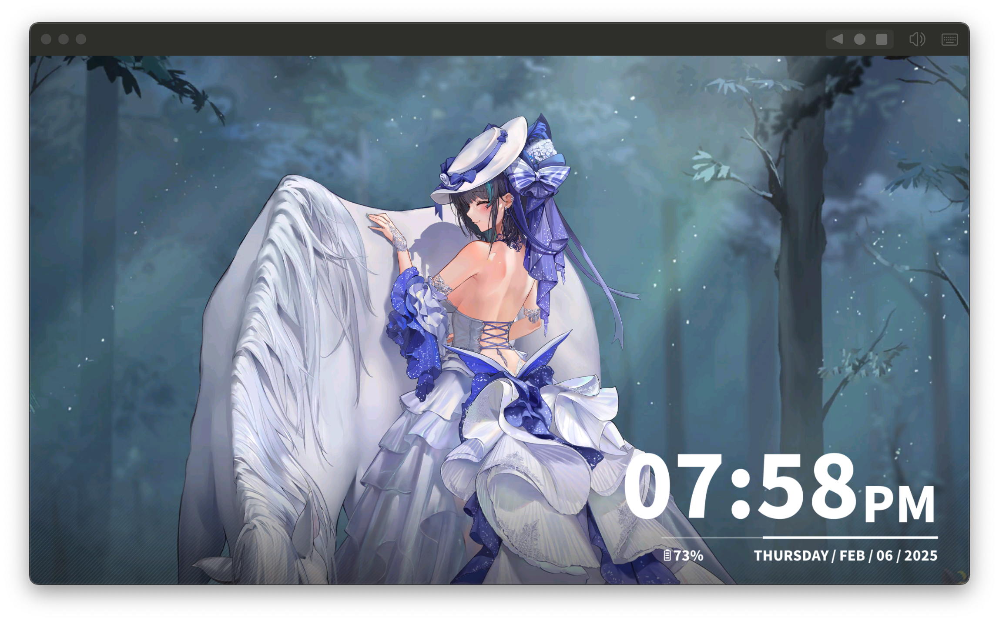

# CheshireLane9


CheshireLane9 is a server emulator for an anime fleet game client Version 9.x.

It is an upgrade of the old [CheshireLane-Public](https://github.com/Irminsul-dev/CheshireLane-Public.git) project. The name changed because the client did. The problems, naturally, found new and interesting ways to remain problems.

## Screenshot



The repository lives at:

```bash
git clone https://github.com/Irminsul-dev/CheshireLane9.git
cd CheshireLane9
```

## What It Is

CheshireLane9 currently runs the SDK, dispatch, gate, and game handling in one Rust binary. There is no heroic service mesh here; one executable is already enough paperwork.

The implementation uses local protobuf definitions under `crates/proto`, game data from `assets/game`, and a SQLite database by default. Configuration is generated from `src/config.default.toml` into `config.toml` on first run.

We know you all want the damn proto files directly, so this time they are open-sourced too; spare yourselves the miserable little scripts people keep writing to extract them.

Default ports:

- SDK HTTP: `21080`
- SDK HTTPS: `21443`
- Dispatch: `21180`
- Gate: `21280`

## Supported Features

### SDK Account Login

**Use any email-formatted string as the account, then use verification code `114514` to register or log in directly.**

### The Game's **Real** Core Gameplay

- View ships in the dock.
- View and change ship skins.

### Chat Commands

Commands are sent as plain text in the in-game chat. They do not use `/`.

| Command | Effect |
| --- | --- |
| `help` | Shows the available commands. Unknown commands also return the help text. |
| `ship` | Adds the currently supported ship set to the account and refreshes ship data. |
| `skin` | Unlocks skins for the ships currently on the account and refreshes skin data. |

Typical use:

```text
ship
skin
```

Run `ship` before `skin` if you want skins for newly added ships.

## Requirements

To build and run the server:

- Rust toolchain
- The game data already present under `assets/game`
- A client compatible with Version 9.x

For client redirection, depending on your device setup, you may also need:

- User CA trust support, for example [NVISOsecurity/AlwaysTrustUserCerts](https://github.com/NVISOsecurity/AlwaysTrustUserCerts)
- [cheshire-game-redirect-magisk](https://github.com/Irminsul-dev/cheshire-game-redirect-magisk), if you need game traffic redirection on Android

## Build And Run

```bash
cargo run -p cheshire-server
```

The server reads `config.toml` from the working directory. If the file does not exist, it writes the default one. This is convenient, unless you expected configuration to be a spiritual journey.

On first start it also generates a persistent local CA and an SDK TLS certificate when they do not exist:

- `assets/ca/ca-cert.cer` — install this certificate on the client as a trusted CA
- `assets/ca/ca-key.pem` — keep this private and never copy it to the client
- `assets/tls/cert.pem` and `assets/tls/key.pem` — SDK HTTPS certificate signed by the local CA

Existing certificate pairs are reused. If either CA file is missing, a new CA and SDK TLS pair are generated. If only one SDK TLS file is missing, the SDK TLS pair is regenerated.

## SDK Proxy

The Rust server includes an HTTP(S) MITM proxy, so Python and mitmproxy are not required. Its default configuration is:

```toml
sdk_proxy_addr = "0.0.0.0:28080"
sdk_proxy_upstream_addr = "127.0.0.1:21080"
mitm_ca_cert_path = "assets/ca/ca-cert.cer"
mitm_ca_key_path = "assets/ca/ca-key.pem"
```

The proxy intercepts:

- `jp-sdk-api.yostarplat.com`
- `en-sdk-api.yostarplat.com`

and forwards those requests to `sdk_proxy_upstream_addr`. Other HTTPS destinations remain ordinary CONNECT tunnels and are not decrypted.

To use it from Android:

1. Start `cheshire-server` once so the CA is generated.
2. Copy `assets/ca/ca-cert.cer` to the phone and install it as a CA certificate.
3. Set the phone's HTTP proxy to the Cheshire server IP and port `28080`.
4. Use the Magisk game redirect module as before for dispatch/game traffic.

Android applications do not always trust user-installed CAs. Magisk plus AlwaysTrustUserCerts, or installing the generated CA into the system trust store, may still be required.

The default proxy listener binds to all interfaces. Only expose it to a trusted LAN or restrict access with a firewall; otherwise it can be abused as an open forward proxy.

### Game Redirect

Use [cheshire-game-redirect-magisk](https://github.com/Irminsul-dev/cheshire-game-redirect-magisk) and follow its instructions.

## Status

This is research software. Some flows work, some flows are placeholders, and some flows are still waiting for more testing to explain what they want when they grow up.

Use it for learning, protocol work, and local experiments. Do not sell it, do not run a public service with it, and do not make the maintainer read legal emails before coffee.
